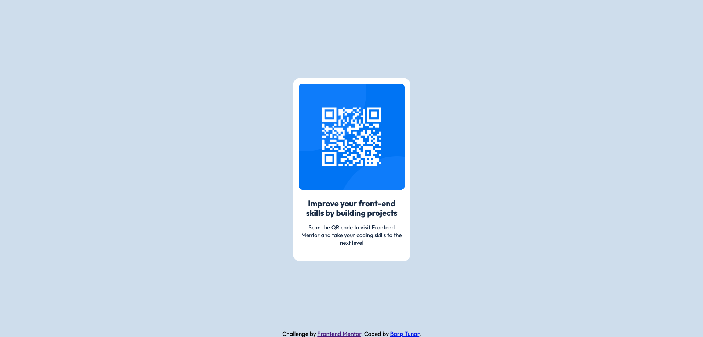
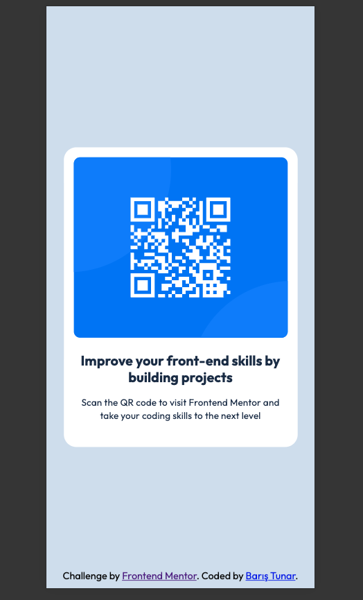

# Frontend Mentor - QR code component solution

This is a solution to the [QR code component challenge on Frontend Mentor](https://www.frontendmentor.io/challenges/qr-code-component-iux_sIO_H). Frontend Mentor challenges help you improve your coding skills by building realistic projects. 

## Table of contents

  - [Screenshot](#screenshot)
  - [Links](#links)
  - [Built with](#built-with)
  - [Author](#author)

### Screenshot

### Links

- Solution URL: [GitHub Repository](https://github.com/baristunar/qr-code-component)
- Live Site URL: [GitHub Pages](https://baristunar.github.io/qr-code-component/)

### Built with

- Semantic HTML5 markup
- CSS custom properties
- Flexbox
- Mobile-first workflow

### Author

- Website - [Barış Tunar](https://www.baristunar.com)
- Frontend Mentor - [@baristunar](https://www.frontendmentor.io/profile/baristunar)
- Twitter - [@baristunar](https://www.twitter.com/baristunar)
